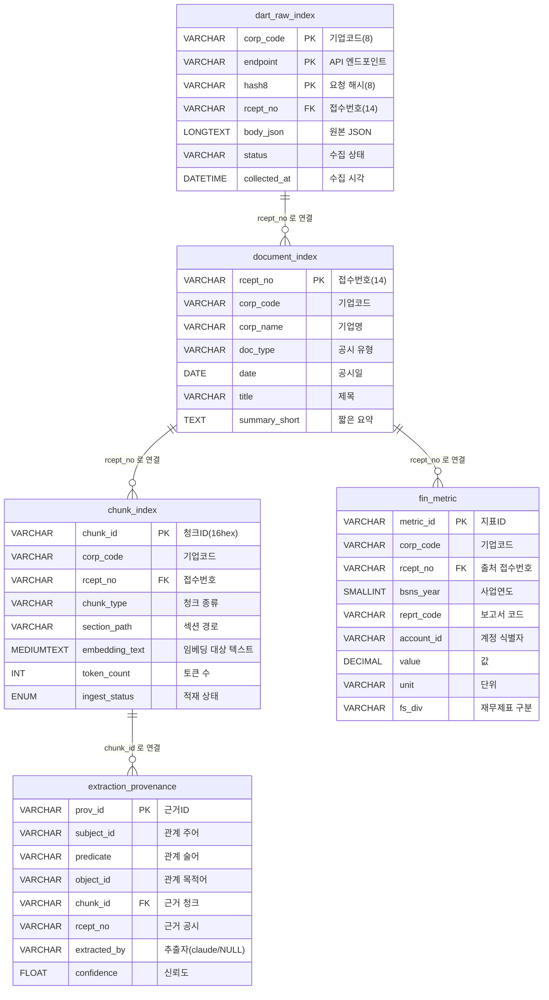

# POLARIS DB 설계 — 01. MariaDB (테이블 설계)

MariaDB의 역할 = **원본 SSOT + 정형 재무 + 본문 청크 + 근거원장**.
공시(DART) 중심으로 단순화한 **5개 테이블** 구성입니다. 모든 테이블은 `ENGINE=InnoDB`, `CHARSET=utf8mb4`.

> 영문 테이블/컬럼명에는 각각 한글 뜻을 같이 적었습니다. 처음 보시는 분은 **이름 → 한 줄 뜻 → 표** 순서로 읽으시면 됩니다.

---

## 1. 테이블 한눈에 (5개)

| 테이블 (영문) | 한글 의미 | 한 줄 역할 | PK(기본키) |
|---|---|---|---|
| `dart_raw_index` | DART 원본 인덱스 | DART API 응답 JSON 원본 보관 (SSOT) | (corp_code, endpoint, hash8) |
| `document_index` | 공시 문서 인덱스 | 공시 1건의 메타데이터(누가·언제·무슨 종류) | rcept_no |
| `chunk_index` | 청크 인덱스 | 본문을 작게 자른 청크 텍스트 + 메타 (3-DB 조인 허브) | chunk_id |
| `fin_metric` | 재무 지표 | 정형 재무 수치(매출·자산 등) | metric_id |
| `extraction_provenance` | 추출 근거 원장 | "어떤 청크에서 어떤 관계가 추출됐는지" 기록 | prov_id |

> PK = Primary Key (기본키, 행을 유일하게 식별). FK = Foreign Key (외래키, 다른 테이블과 연결).
> SSOT = Single Source of Truth (단일 진실 원천). "원본은 여기 한 곳"이라는 규칙.

---

## 2. ERD (테이블 관계도)

---

## 3. 테이블별 상세

### 3.1 `dart_raw_index` — DART 원본 인덱스

DART OpenAPI 응답 JSON을 **그대로 보관**하는 단일 진실 원천(SSOT). 가공된 후 어디서 문제가 생기면 항상 이 테이블의 원본을 다시 본다.

| 컬럼 (영문) | 한글 의미 | 타입 | 키 | 설명 |
|---|---|---|---|---|
| `corp_code` | 기업코드 | VARCHAR(8) | PK | DART가 부여한 기업 고유코드 8자리 |
| `endpoint` | API 엔드포인트 | VARCHAR(128) | PK | 호출한 DART API 경로 (예: `/api/list.json`) |
| `hash8` | 요청 해시 | VARCHAR(8) | PK | 요청 파라미터 해시 앞 8자리(같은 호출 중복 식별) |
| `rcept_no` | 접수번호 | VARCHAR(14) | FK | 공시 접수번호 14자리, 공시 단위 교차키 |
| `body_json` | 응답 본문 | LONGTEXT | | DART API 응답 JSON 원본 전체 |
| `status` | 수집 상태 | VARCHAR(16) | | `ok` / `error` 등 |
| `collected_at` | 수집 시각 | DATETIME | | 우리가 받아온 시각 |

> `body_json` 에 JSON 원본을 통째로 박아두는 이유: 나중에 스키마가 바뀌어도 원본은 손대지 않고 재가공할 수 있게.

---

### 3.2 `document_index` — 공시 문서 인덱스

공시 1건의 **메타데이터**(누가, 언제, 무슨 종류의 공시인지). `dart_raw_index` 에서 정리해 뽑아낸 요약 인덱스.

| 컬럼 (영문) | 한글 의미 | 타입 | 키 | 설명 |
|---|---|---|---|---|
| `rcept_no` | 접수번호 | VARCHAR(14) | PK | 공시 접수번호 14자리 |
| `corp_code` | 기업코드 | VARCHAR(8) | | DART 기업코드 |
| `corp_name` | 기업명 | VARCHAR(64) | | 회사 이름 (예: 삼성전자) |
| `doc_type` | 공시 유형 | VARCHAR(128) | | 사업보고서/반기/분기/주요사항 등 |
| `date` | 공시일 | DATE | | 공시 접수/공시일 |
| `title` | 제목 | VARCHAR(256) | | 공시 제목 |
| `summary_short` | 짧은 요약 | TEXT | | 미리보기용 요약 |

---

### 3.3 `chunk_index` — 청크 인덱스 (3-DB 조인 허브)

공시 본문을 작은 조각(**청크**)으로 자른 결과. **MariaDB · Neo4j · Qdrant 세 DB를 묶는 조인 허브**.

| 컬럼 (영문) | 한글 의미 | 타입 | 키 | 설명 |
|---|---|---|---|---|
| `chunk_id` | 청크ID | VARCHAR(16) | PK | 16자리 hex (콘텐츠 해시이므로 단독 유일) |
| `corp_code` | 기업코드 | VARCHAR(8) | | 어느 기업의 공시인지 |
| `rcept_no` | 접수번호 | VARCHAR(14) | FK | 어느 공시에서 잘렸는지 |
| `chunk_type` | 청크 종류 | VARCHAR(32) | | `text_micro` / `text_macro` / `table_nl` |
| `section_path` | 섹션 경로 | VARCHAR(256) | | 문서 내 위치 (예: `II. 사업의 내용 > 4. 매출`) |
| `embedding_text` | 임베딩 대상 텍스트 | MEDIUMTEXT | | 헤딩 프리픽스 + 본문 |
| `token_count` | 토큰 수 | INT | | 청크 토큰 길이 |
| `ingest_status` | 적재 상태 | ENUM | | `pending` / `ready` |

청크 종류 설명:
- `text_micro` — 산문 청크(800자/80자 오버랩). **기본 단위**.
- `text_macro` — 섹션 통째 부모 청크. **현재 미사용** (추후 컨텍스트 확장용 예약).
- `table_nl` — 표를 행 단위 자연어로 펼친 청크. (`헤더=값` 형식)

> 청킹 정책 상세는 `03_qdrant.md` 참고.

---

### 3.4 `fin_metric` — 재무 지표

정형 재무 수치(매출·자산·부채 등). Neo4j `FinMetric` 노드의 SSOT.

| 컬럼 (영문) | 한글 의미 | 타입 | 키 | 설명 |
|---|---|---|---|---|
| `metric_id` | 지표ID | VARCHAR(32) | PK | 재무 지표 식별자 |
| `corp_code` | 기업코드 | VARCHAR(8) | | 어느 기업의 지표인지 |
| `rcept_no` | 출처 접수번호 | VARCHAR(14) | FK | 어느 공시에서 나온 수치인지 (근거) |
| `bsns_year` | 사업연도 | SMALLINT | | 회계연도 (예: 2024) |
| `reprt_code` | 보고서 코드 | VARCHAR(8) | | 사업/반기/분기 보고서 구분 코드 |
| `account_id` | 계정 식별자 | VARCHAR(255) | | IFRS taxonomy id (예: `ifrs-full_Revenue`) |
| `value` | 값 | DECIMAL(28,2) | | 지표 값 (큰 수 보존을 위해 DECIMAL) |
| `unit` | 단위 | VARCHAR(16) | | KRW, USD 등 |
| `fs_div` | 재무제표 구분 | VARCHAR(8) | | CFS(연결) / OFS(별도) 등 |

> 왜 DECIMAL(28,2)? — 삼성전자 매출 같은 큰 숫자(수백조)도 부동소수점 오차 없이 정확히 보존하려고.

---

### 3.5 `extraction_provenance` — 추출 근거 원장

Claude가 본문에서 **추출한 관계의 근거**를 기록하는 원장. "이 관계가 어떤 청크의 어떤 부분에서 나왔다"를 추적할 수 있게 한다.

| 컬럼 (영문) | 한글 의미 | 타입 | 키 | 설명 |
|---|---|---|---|---|
| `prov_id` | 근거ID | VARCHAR(32) | PK | 근거 레코드 식별자 |
| `subject_id` | 관계 주어 | VARCHAR(64) | | 관계의 출발 엔티티 ID |
| `predicate` | 관계 술어 | VARCHAR(32) | | 관계 종류 (예: `SUPPLIES_TO`) |
| `object_id` | 관계 목적어 | VARCHAR(64) | | 관계의 도착 엔티티 ID |
| `chunk_id` | 근거 청크 | VARCHAR(16) | FK | 어느 청크에서 나왔는지 |
| `rcept_no` | 근거 공시 | VARCHAR(14) | | 어느 공시에서 나왔는지 |
| `extracted_by` | 추출자 | VARCHAR(16) | | `'claude'`(추출) / `NULL`(DART 사실) |
| `confidence` | 신뢰도 | FLOAT | | 0.0 ~ 1.0 |

> PROV = Provenance(출처·내력). W3C PROV-O 표준을 따라 "어떤 데이터가 어디서 왔는지" 추적 가능하게 한 원장.

---

## 4. 교차키 정리 (다시 한 번)

3개 DB를 묶는 공통 식별자. **반드시 형식을 똑같이** 유지한다.

| 키 | 형식 | 쓰이는 곳 |
|---|---|---|
| `corp_code` | 8자리 숫자 | 기업 단위 식별. 거의 모든 테이블 + Neo4j `Organization` + Qdrant payload |
| `rcept_no` | 14자리 숫자 | 공시 단위 교차키. `dart_raw_index`·`document_index`·`chunk_index`·`fin_metric`·`extraction_provenance` 공유 |
| `chunk_id` | 16자리 hex | 청크 단위 교차키. `chunk_index` ↔ Qdrant 포인트 ↔ Neo4j `Chunk` 연결 |

---

## 5. 제거된 테이블 (참고)

v2 → v3 단순화 과정에서 **삭제된 테이블**들. 다시 만들지 말 것.

`document_unified`, `sentiment_daily`, `doc_sentiment`, `mention_daily`, `news_daily_summary`, `news_raw`, `news_matched`, `keyword_top`, `edge_snapshot`, `ir_report`, `chunk_summary`

이유: 데이터 소스를 **DART 공시 단일**로 좁히면서 뉴스·SNS·감성·키워드·통합 doc 테이블이 모두 불필요해졌음.
