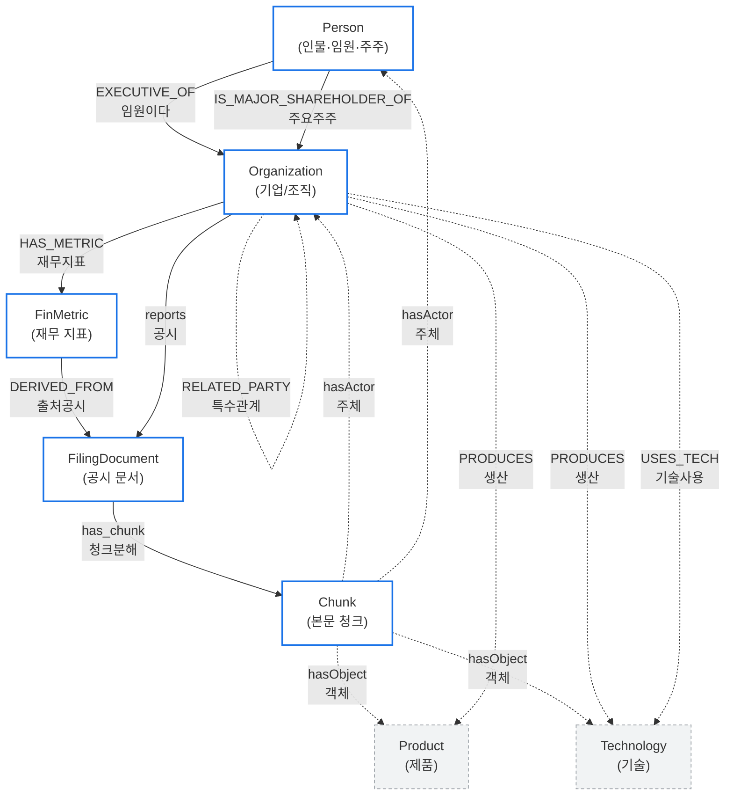

# POLARIS DB 설계 — 02. Neo4j (그래프 DB)

Neo4j의 역할 = **엔티티(노드)와 관계(엣지)의 그래프**. 지분과 재무를 1급 시민으로 두고, 본문에서 추출된 관계는 **근거 청크**까지 역추적된다. 공시 GraphRAG의 그래프 본체.

> 그래프 DB = **점(노드)** 과 **선(엣지)** 으로 데이터를 표현하는 DB. "삼성전자가 자회사 A의 주요주주" 같은 **관계**를 자연스럽게 다루는 데 강함.
> 멀티홉 = "A→B→C→..." 처럼 관계를 **여러 단계** 따라가는 탐색.

---

## 1. 노드 라벨 목록 (7종)

> 라벨 = 노드의 종류 (SQL의 테이블 이름 같은 개념). 영문 라벨 옆에 한글 의미를 같이 적었습니다.

| 라벨 (영문) | 한글 의미 | 유니크 키 | 주요 속성 | 출처 |
|---|---|---|---|---|
| `Organization` | 기업/조직 | `corp_code` | name(기업명), stock_code(주식코드), founded(설립일) | DART |
| `Person` | 인물 (임원·주주) | `person_id` | name(이름), birth_ym(생년월) | DART |
| `FilingDocument` | 공시 문서 | `rcept_no` | doc_type(공시유형), date(공시일) | DART |
| `Chunk` | 본문 청크 | `chunk_id` | corp_code, chunk_type, section_path | 청킹 파이프라인 |
| `FinMetric` | 재무 지표 | `metric_id` | account_id(계정), bsns_year(연도), value(값), unit(단위) | DART → MariaDB `fin_metric` 미러 |
| `Product` | 제품 | `product_id` | name, canonical(정규명) | Claude 추출 |
| `Technology` | 기술 | `tech_id` | name, canonical(정규명) | Claude 추출 |

> 정규명(canonical) = 표면형이 여러 가지여도 하나의 표준 이름으로 묶기 위한 필드.
> 노드 라벨 = Cypher에서 `(:Organization)` 처럼 콜론 뒤에 붙는 이름.

---

## 2. 관계(엣지) 목록 — 출처에 따라 둘로 나뉨

엣지마다 `extracted_by` 속성으로 **출처를 구분**한다:
- `extracted_by IS NULL` → **DART 공시에 명시된 사실** (정형)
- `extracted_by = 'claude'` → **본문에서 Claude가 추출한 해석** (비정형)

### 2-1. 정형 관계 (DART 공시 사실) — `extracted_by IS NULL`

| 관계타입 (영문) | 한글 의미 | 출발 → 도착 | 주요 속성 | 설명 |
|---|---|---|---|---|
| `:EXECUTIVE_OF` | "~의 임원이다" | Person → Organization | valid_from(시작일), rcept_no | 임원 등재 사실 |
| `:IS_MAJOR_SHAREHOLDER_OF` | "~의 주요주주다" | Organization \| Person → Organization | qota_rt(지분율%), posesn_stock_co(보유주식수), rcept_no | 5% 이상 등 주요주주 |
| `:INVESTS_IN` | "~에 투자한다" | Organization → Organization | qota_rt(지분율%), rcept_no | 일반 출자/투자 |
| `:IS_SUBSIDIARY_OF` | "~의 자회사다" | Organization → Organization | — | 종속회사 관계 |
| `:HAS_METRIC` | "~의 재무지표를 가진다" | Organization → FinMetric | — | 재무수치 연결 |
| `:DERIVED_FROM` | "~에서 유래" | FinMetric → FilingDocument | — | 수치의 출처 공시 |
| `:reports` | "~을 보고한다" | Organization → FilingDocument | — | 회사가 공시한 문서 |
| `:has_chunk` | "~을 청크로 포함" | FilingDocument → Chunk | — | 공시 → 청크 분해 |

### 2-2. 비정형 관계 (Claude 추출) — `extracted_by = 'claude'`

공통 속성: `extracted_by='claude'`, `chunk_id`(근거 청크), `rcept_no`(원문 공시), `confidence`(신뢰도).
역추적 방법: 엣지의 `chunk_id` → `(:Chunk)` → `(:FilingDocument)` → `rcept_no` → DART 원문.

| 관계타입 (영문) | 한글 의미 | 출발 → 도착 | 추가 속성 | 설명 |
|---|---|---|---|---|
| `:hasActor` | "주체로 등장" | Chunk → Organization \| Person | — | 청크 본문에 언급된 행위 주체 |
| `:hasObject` | "객체로 등장" | Chunk → Product \| Technology | — | 청크 본문에 언급된 객체 |
| `:PRODUCES` | "~을 생산한다" | Organization → Product \| Technology | — | 회사의 생산물 |
| `:USES_TECH` | "~기술을 사용한다" | Organization → Technology | — | 회사가 사용하는 기술 |
| `:SUPPLIES_TO` | "~에 공급한다" | Organization → Organization | — | 공급-수요 관계 (밸류체인) |
| `:RELATED_PARTY` | "특수관계자" | Organization → Organization | relation_type(관계유형) | 특수관계자 거래 |

> "1급 시민(first-class citizen)" = 그래프 설계에서 **가장 중요한 주인공**으로 다룬다는 의미. 여기서는 **지분(`IS_MAJOR_SHAREHOLDER_OF`·`INVESTS_IN`)** 과 **재무(`HAS_METRIC`)** 가 1급 시민. 이 두 가지를 한 질의로 묶을 수 있는 게 GraphRAG의 핵심 차별점.

---

## 3. 그래프 다이어그램

**실선** = 정형(DART 공시·사실, `extracted_by IS NULL`)
**점선** = 비정형(Claude 추출, `extracted_by='claude'`)



**범례**
- 파란 테두리 노드(`Person`, `Organization`, `FilingDocument`, `Chunk`, `FinMetric`) = **정형 그래프의 골격**
- 회색 점선 노드(`Product`, `Technology`) = **추출 레이어** (본문에서 뽑은 것)
- 실선 화살표 = DART 사실, 점선 화살표 = Claude 추출

---

## 4. Cypher 제약 (CREATE CONSTRAINT)

> Cypher = Neo4j의 질의 언어. SQL과 유사한 역할. `CREATE CONSTRAINT` = "이 속성은 유일해야 한다" 같은 제약을 거는 명령.

```cypher
// 각 노드의 유니크 키 — 같은 키로 들어오면 합쳐지도록(MERGE 가능)
CREATE CONSTRAINT org_corp_code IF NOT EXISTS
  FOR (o:Organization) REQUIRE o.corp_code IS UNIQUE;

CREATE CONSTRAINT person_id IF NOT EXISTS
  FOR (p:Person) REQUIRE p.person_id IS UNIQUE;

CREATE CONSTRAINT filing_rcept_no IF NOT EXISTS
  FOR (f:FilingDocument) REQUIRE f.rcept_no IS UNIQUE;

CREATE CONSTRAINT finmetric_id IF NOT EXISTS
  FOR (m:FinMetric) REQUIRE m.metric_id IS UNIQUE;

CREATE CONSTRAINT product_id IF NOT EXISTS
  FOR (pr:Product) REQUIRE pr.product_id IS UNIQUE;

CREATE CONSTRAINT tech_id IF NOT EXISTS
  FOR (t:Technology) REQUIRE t.tech_id IS UNIQUE;

// chunk_id 는 16자리 hex 콘텐츠 해시이므로 단독 유일
CREATE CONSTRAINT chunk_key IF NOT EXISTS
  FOR (c:Chunk) REQUIRE c.chunk_id IS UNIQUE;
```

---

## 5. 데이터 예시 (Cypher)

### 5-1. 지분 관계 (정형) — DART 공시 사실

```cypher
// 삼성전자(00126380)가 자회사 A(00164742)의 주요주주
MERGE (s:Organization {corp_code: '00126380'})
  SET s.name = '삼성전자'
MERGE (t:Organization {corp_code: '00164742'})
MERGE (s)-[:IS_MAJOR_SHAREHOLDER_OF {
  qota_rt: 23.1,                  // 지분율 23.1%
  posesn_stock_co: 1500000,       // 보유주식 150만주
  rcept_no: '20250331000123'      // 출처 공시
}]->(t);
```

### 5-2. 재무 지표 (정형) — `HAS_METRIC` + `DERIVED_FROM`

```cypher
// 삼성전자 2024년 매출액
MERGE (o:Organization {corp_code: '00126380'})
MERGE (m:FinMetric {metric_id: 'fm_2024_revenue_00126380'})
  SET m.account_id = 'ifrs-full_Revenue',   // 계정: 매출액
      m.bsns_year = 2024,
      m.value = 300870900000000,             // 300조 8709억
      m.unit = 'KRW'
MERGE (f:FilingDocument {rcept_no: '20250331000123'})
  SET f.doc_type = 'A001',                   // 사업보고서
      f.date = date('2025-03-31')
MERGE (o)-[:HAS_METRIC]->(m)
MERGE (m)-[:DERIVED_FROM]->(f);
```

### 5-3. 추출 관계 (비정형) — 공급망 + 근거 청크

```cypher
// "A가 삼성전자에 공급한다"가 어떤 사업보고서 청크에서 추출됨
MERGE (sup:Organization {corp_code: '00164742'})
MERGE (buy:Organization {corp_code: '00126380'})
MERGE (sup)-[r:SUPPLIES_TO]->(buy)
  SET r.extracted_by = 'claude',
      r.confidence = 0.86,
      r.chunk_id = 'a1b2c3d4e5f60718',  // 근거 청크
      r.rcept_no = '20250311001085';     // 원문 공시
// → MariaDB extraction_provenance 에도 같은 내용이 1행 기록됨
```

---

## 6. GraphRAG 활용 예시 (Cypher)

### 6-1. 지분 따라 2홉 + 각 회사의 매출액

> "삼성전자가 직·간접으로 투자한 회사들의 매출"을 **한 번의 질의**로 조회.
> 벡터 RAG로는 불가능한 멀티홉 질의의 대표 예시.

```cypher
MATCH (root:Organization {corp_code: '00126380'})
MATCH path = (root)-[:IS_MAJOR_SHAREHOLDER_OF|INVESTS_IN*1..2]->(target:Organization)
OPTIONAL MATCH (target)-[:HAS_METRIC]->(m:FinMetric {account_id: 'ifrs-full_Revenue'})
RETURN root.name AS 시작회사,
       [n IN nodes(path) | n.name] AS 지분경로,
       target.name AS 도착회사,
       m.bsns_year AS 사업연도,
       m.value AS 매출액
ORDER BY length(path), 매출액 DESC;
```

### 6-2. 청크 → 근거 역추적 (추출 관계의 출처 검증)

> "Claude가 SUPPLIES_TO 라고 한 근거가 어느 공시의 어느 섹션인가?"

```cypher
MATCH (sup:Organization)-[r:SUPPLIES_TO {extracted_by: 'claude'}]->(buy:Organization)
MATCH (c:Chunk {chunk_id: r.chunk_id})
OPTIONAL MATCH (f:FilingDocument)-[:has_chunk]->(c)
RETURN sup.name AS 공급사,
       buy.name AS 수요사,
       r.confidence AS 신뢰도,
       c.chunk_id AS 근거청크,
       c.section_path AS 섹션,
       f.rcept_no AS 원문공시번호,
       f.date AS 공시일;
```

---

## 7. 핵심 규약 (요약)

1. **출처 구분 필수** — `extracted_by='claude'`(추출) vs `extracted_by IS NULL`(DART 사실)
2. **지분+재무 1급 시민** — `IS_MAJOR_SHAREHOLDER_OF`/`INVESTS_IN` (지분율 = 엣지 속성) + `HAS_METRIC` (재무) 를 묶어 멀티홉 질의 가능하게
3. **PROV 근거추적** — 모든 추출 엣지는 `chunk_id`·`rcept_no`·`confidence` 속성 + MariaDB `extraction_provenance` 원장 1행
4. **변화감지** — `valid_from` + `rcept_no`(공시일)로 시점 박제, 같은 관계를 시점별 비교 가능
5. **별도 reification 노드 없음** — 옛 설계의 `Statement`/`Event`/`ExtractionActivity` 는 그래프 탐색 단절·이중표현 문제로 제거. 근거는 엣지 속성으로 직접 보존.

> reification = 관계 자체를 노드로 만드는 기법. 표현력은 있지만 탐색이 끊겨서 본 설계에서는 제거함.

---

## 8. 참고 레퍼런스

- Neo4j sec-edgar (Company / Person / Form / Chunk + OWNS{지분, 시점})
- Microsoft GraphRAG (Local / Global 검색)
- W3C PROV-O (근거추적 표준)
