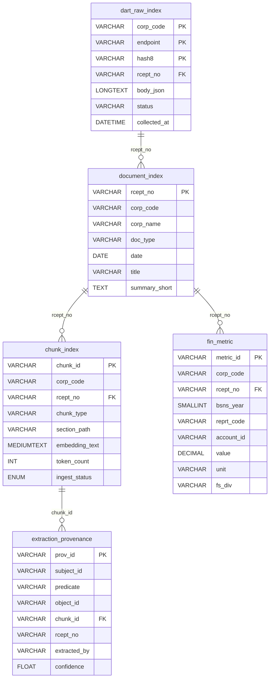

# POLARIS DB 설계서 — 01. MariaDB

MariaDB = 원본 SSOT(`dart_raw_index`) + 정형재무(`fin_metric`) + 청크텍스트(조인허브 `chunk_index`) + 근거원장(`extraction_provenance`).

공시(DART) 중심으로 단순화한 5테이블 구성이다. 모든 테이블은 `ENGINE=InnoDB`, `CHARSET=utf8mb4`.

## 1. ERD (Mermaid)

## 2. 테이블별 상세

### 2.1 `dart_raw_index`
용도: DART OpenAPI JSON 응답 원본을 그대로 보관하는 SSOT(단일 진실 원천).

| 컬럼 | 타입 | 키 | 설명 |
|------|------|----|------|
| corp_code | VARCHAR(8) | PK | DART 고유 기업코드(8자리) |
| endpoint | VARCHAR(128) | PK | 호출한 DART API 엔드포인트 |
| hash8 | VARCHAR(8) | PK | 요청 파라미터 해시 앞 8자리(중복 호출 식별) |
| rcept_no | VARCHAR(14) | FK | 접수번호(14자리), 공시 단위 교차키 |
| body_json | LONGTEXT | | DART API 응답 JSON 전체 원본 |
| status | VARCHAR(16) | | 수집 상태(예: ok / error) |
| collected_at | DATETIME | | 수집 시각 |

### 2.2 `document_index`
용도: 공시 문서 단위 메타데이터(어떤 기업의 어떤 공시인지).

| 컬럼 | 타입 | 키 | 설명 |
|------|------|----|------|
| rcept_no | VARCHAR(14) | PK | 접수번호(14자리) |
| corp_code | VARCHAR(8) | | DART 기업코드(8자리) |
| corp_name | VARCHAR(64) | | 기업명 |
| doc_type | VARCHAR(128) | | 공시 문서 유형 |
| date | DATE | | 공시 접수/공시일 |
| title | VARCHAR(256) | | 공시 제목 |
| summary_short | TEXT | | 짧은 요약 |

### 2.3 `chunk_index`
용도: 청크 텍스트와 메타를 담는 3-DB 조인 허브(MariaDB·Neo4j·Qdrant 연결점).

| 컬럼 | 타입 | 키 | 설명 |
|------|------|----|------|
| chunk_id | VARCHAR(16) | PK | 청크 식별자(16자리 hex) |
| corp_code | VARCHAR(8) | | DART 기업코드(8자리) |
| rcept_no | VARCHAR(14) | FK | 접수번호(14자리), 원 공시 연결 |
| chunk_type | VARCHAR(32) | | `text_micro` / `text_macro` / `table_nl` |
| section_path | VARCHAR(256) | | 문서 내 섹션 경로 |
| embedding_text | MEDIUMTEXT | | 임베딩 대상 텍스트(프리픽스 헤딩 포함) |
| token_count | INT | | 토큰 수 |
| ingest_status | ENUM('pending','ready') | | 적재 상태 |

청킹 정책(요약, 상세는 [README §3.1](README.md)):
- `chunk_type` 매핑: 산문 = `text_micro`(800자/80오버랩), 표 = `table_nl`(행 펼침). `text_macro`는 예약값(현재 미생성).
- `embedding_text` = 프리픽스 헤딩 `[회사명 · 문서(YYYY.MM) · section_path]` + 본문. 프리픽스는 여기에만 넣고 Qdrant payload에는 넣지 않는다(contextual retrieval).
- `section_path` 예: `II. 사업의 내용 > 4. 매출 및 수주상황`.
- 날짜 컬럼 없음 — `doc_date`(Qdrant payload)는 `document_index.date` 조인으로 채운다.

### 2.4 `fin_metric`
용도: 정형 재무지표(Neo4j `FinMetric` 노드의 SSOT).

| 컬럼 | 타입 | 키 | 설명 |
|------|------|----|------|
| metric_id | VARCHAR(32) | PK | 재무지표 식별자 |
| corp_code | VARCHAR(8) | | DART 기업코드(8자리) |
| rcept_no | VARCHAR(14) | FK | 접수번호(14자리), 출처 공시 |
| bsns_year | SMALLINT | | 사업연도 |
| reprt_code | VARCHAR(8) | | 보고서 코드(분기/반기/사업보고서 등) |
| account_id | VARCHAR(255) | | 계정 식별자(IFRS taxonomy id, 최대 약 145자) |
| value | DECIMAL(28,2) | | 지표 값 |
| unit | VARCHAR(16) | | 단위 |
| fs_div | VARCHAR(8) | | 재무제표 구분(CFS/OFS 등) |

### 2.5 `extraction_provenance`
용도: 추출된 관계의 근거 원장(PROV) — 어떤 청크/공시에서 어떤 관계가 어떻게 나왔는지.

| 컬럼 | 타입 | 키 | 설명 |
|------|------|----|------|
| prov_id | VARCHAR(32) | PK | 근거 레코드 식별자 |
| subject_id | VARCHAR(64) | | 관계 주어 식별자 |
| predicate | VARCHAR(32) | | 관계 술어(predicate) |
| object_id | VARCHAR(64) | | 관계 목적어 식별자 |
| chunk_id | VARCHAR(16) | FK | 근거 청크 식별자(16자리 hex) |
| rcept_no | VARCHAR(14) | | 접수번호(14자리), 근거 공시 |
| extracted_by | VARCHAR(16) | | `'claude'`(본문 추출, 로컬LLM `'q3.5:9b'` 등 포함) 또는 `NULL`(DART 사실) |
| confidence | FLOAT | | 추출 신뢰도 |

## 3. 교차키 노트

- `corp_code` VARCHAR(8) — DART 기업 고유코드. 기업 단위 식별.
- `rcept_no` VARCHAR(14) — 접수번호. 공시 문서 단위 교차키(`dart_raw_index`·`document_index`·`chunk_index`·`fin_metric`·`extraction_provenance` 공유).
- `chunk_id` VARCHAR(16) — 16자리 hex. 청크 단위 교차키(`chunk_index` ↔ `extraction_provenance`, Qdrant 포인트/Neo4j 노드 연결). 콘텐츠 해시이므로 단독으로 유일하다.

## 4. 제거된 테이블 (기존 → 신규)

이번 공시중심 단순화에서 제거됨: `document_unified`, `sentiment_daily`, `doc_sentiment`, `mention_daily`, `news_daily_summary`, `news_raw`, `news_matched`, `keyword_top`, `edge_snapshot`, `ir_report`, `chunk_summary`.
