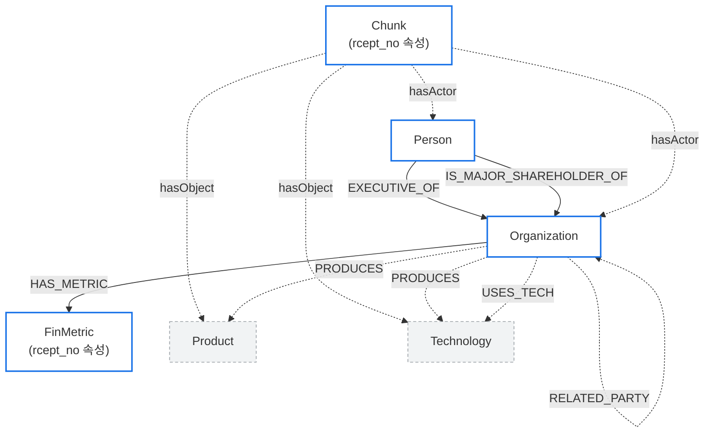

# POLARIS DB 설계서 — 03. Neo4j (그래프DB)

Neo4j = 엔티티·관계 그래프. 지분과 재무를 1급 시민으로 두고(멀티홉 질의), 모든 추출 관계는 PROV 근거(원문 청크·추출 활동)로 역추적한다. 공시 GraphRAG의 그래프 본체가 여기다.

---

## 1. 노드 라벨 표

| 라벨 | 키 | 주요 속성 | 설명 |
|---|---|---|---|
| `Organization` | corp_code (UNIQUE) | name, stock_code, founded | 회사 |
| `Person` | person_id | name, birth_ym | 임원·주주 |
| `Chunk` | chunk_id (UNIQUE) | corp_code, chunk_type, section_path, **rcept_no, doc_date** | 추출 근거 본문조각(관계 근거만 보존) |
| `FinMetric` | metric_id | account_id, bsns_year, value, unit, reprt_code, fs_div, **rcept_no** | 재무지표 (MariaDB `fin_metric` 미러) |
| `Product` | product_id | name, canonical | 제품 |
| `Technology` | tech_id | name, canonical | 기술 |

> **그래프 다이어트 (2026-06-05 실행).** Neo4j는 **관계추론 본체**만 둔다. 두 가지 제거:
> - **`FilingDocument` 노드 제거** — 출처(`rcept_no`)는 관계엣지 속성 + `Chunk`·`FinMetric` 노드 속성으로 박제(`reports`·`has_chunk`·`DERIVED_FROM` 엣지도 함께 제거). 공시 메타(문서종류·날짜)·공시목록은 MariaDB `document_index`가 SSOT.
> - **`Chunk` 노드 98% 제거** — 어떤 관계도 근거하지 않는 죽은 청크(131,892 → 2,559)는 멀티홉에 무용이라 Neo4j에서 삭제. **관계 근거가 되는 청크만 보존.** 전체 청크는 MariaDB `chunk_index`·Qdrant(벡터검색)에 그대로 — 복구·의미검색용.

> 추출 관계(claude)는 **별도 Statement reification 노드 없이 직접 엣지**로 적재한다. 근거는 엣지 속성(`chunk_id`·`rcept_no`·`confidence`·`extracted_by='claude'`) + MariaDB `extraction_provenance` 원장으로 추적한다. (이전 설계의 `Statement`/`Event`/`ExtractionActivity`/`FilingDocument` 노드는 이중표현·탐색 단절·잉여 문제로 제거.)

> **FinMetric 구분키 (`reprt_code`·`fs_div`) 필수.** 같은 `(corp_code, account_id, bsns_year)`라도 보고서종류(사업/반기/분기)·연결여부(연결/별도)에 따라 값이 **여러 개**다(예: 삼성전자 2024 매출 = 8개 행). 구분키 없이 `MATCH (o)-[:HAS_METRIC]->(m:FinMetric {account_id:'ifrs-full_Revenue'})` 하면 중복값이 쏟아져 멀티홉+재무가 깨진다. 따라서 멀티홉 재무 질의는 `{reprt_code:'11011', fs_div:'CFS'}`(연간·연결) 기본 필터를 건다. `reprt_code`: 11011=사업보고서(연간)·11012=반기·11013=1분기·11014=3분기. `fs_div`: CFS=연결·OFS=별도. (정확한 단건 재무는 MariaDB `fin_metric`이 SSOT — 04_graphrag.md 재무 조회 규약 참조.)

---

## 2. 관계(엣지) 표

출처 구분 필수: `extracted_by IS NULL` = DART 공시·사실, `extracted_by='claude'`(또는 로컬LLM `'q3.5:9b'` 등) = 공시 본문 추출(언급·추정).

### 2-1. 정형 — extracted_by IS NULL (DART 공시·사실)

| 관계타입 | 출발 → 도착 | 속성 | 출처 |
|---|---|---|---|
| `:EXECUTIVE_OF` | Person → Organization | valid_from, rcept_no | DART 공시 (NULL) |
| `:IS_MAJOR_SHAREHOLDER_OF` | Organization \| Person → Organization | qota_rt, posesn_stock_co, rcept_no | DART 공시 (NULL) |
| `:INVESTS_IN` | Organization → Organization | qota_rt, rcept_no | DART 공시 (NULL) |
| `:IS_SUBSIDIARY_OF` | Organization → Organization | — | DART 공시 (NULL) |
| `:HAS_METRIC` | Organization → FinMetric | — | DART 공시 (NULL). FinMetric 출처는 노드속성 `rcept_no` |

### 2-2. 비정형 — extracted_by='claude'|로컬LLM (공시 본문 추출)

모든 claude 추출 엣지는 근거 속성 공통: `extracted_by='claude'`, `chunk_id`(근거 청크), `rcept_no`(원문 공시), `confidence`. 청크로의 역추적은 이 `chunk_id`로(별도 reification 노드 없음). 원장은 MariaDB `extraction_provenance`.

| 관계타입 | 출발 → 도착 | 속성 | 출처 |
|---|---|---|---|
| `:hasActor` | Chunk → Organization \| Person | chunk_id 자명 | claude 추출 |
| `:hasObject` | Chunk → Product \| Technology | chunk_id 자명 | claude 추출 |
| `:PRODUCES` | Organization → Product \| Technology | chunk_id, rcept_no, confidence | claude 추출 |
| `:USES_TECH` | Organization → Technology | chunk_id, rcept_no, confidence | claude 추출 |
| `:SUPPLIES_TO` | Organization → Organization | chunk_id, rcept_no, confidence | claude 추출 |
| `:RELATED_PARTY` | Organization → Organization | relation_type, chunk_id, rcept_no, confidence | claude 추출 (특수관계자) |

---

## 3. 스키마 다이어그램 (Mermaid flowchart)

정형(실선) = DART 공시·사실, 비정형(점선) = claude 추출·언급.



범례: 실선 화살표 = 정형(DART 공시·사실), 점선 화살표 = 비정형(claude 추출). `FilingDocument` 노드는 제거됨 — 출처(`rcept_no`)는 `Chunk`·`FinMetric` 노드 속성과 추출 엣지 속성으로 보존.

---

## 4. Cypher 제약(CREATE CONSTRAINT) + 데이터 예시

### 4-1. 제약 (유니크/복합 키)

```cypher
// 단일 유니크 키
CREATE CONSTRAINT org_corp_code IF NOT EXISTS
  FOR (o:Organization) REQUIRE o.corp_code IS UNIQUE;
CREATE CONSTRAINT person_id IF NOT EXISTS
  FOR (p:Person) REQUIRE p.person_id IS UNIQUE;
CREATE CONSTRAINT finmetric_id IF NOT EXISTS
  FOR (m:FinMetric) REQUIRE m.metric_id IS UNIQUE;
CREATE CONSTRAINT product_id IF NOT EXISTS
  FOR (pr:Product) REQUIRE pr.product_id IS UNIQUE;
CREATE CONSTRAINT tech_id IF NOT EXISTS
  FOR (t:Technology) REQUIRE t.tech_id IS UNIQUE;

// chunk_id 는 16hex 콘텐츠 해시이므로 단독으로 유일하다
CREATE CONSTRAINT chunk_key IF NOT EXISTS
  FOR (c:Chunk) REQUIRE c.chunk_id IS UNIQUE;
// (FilingDocument·Statement·Event·ExtractionActivity 노드 제거됨 — 제약 불필요)
```

### 4-2. 데이터 예시

```cypher
// 지분 (정형, extracted_by 미부여 = DART 공시·사실)
MERGE (s:Organization {corp_code: '00126380'})  // 삼성전자
MERGE (t:Organization {corp_code: '00164742'})
MERGE (s)-[:IS_MAJOR_SHAREHOLDER_OF {
  qota_rt: 23.1, posesn_stock_co: 1500000, rcept_no: '20250331000123'
}]->(t);

// 재무 (정형) — HAS_METRIC. 출처 rcept_no 는 FinMetric 노드 속성(FilingDocument 노드 없음)
MERGE (o:Organization {corp_code: '00126380'})
MERGE (m:FinMetric {metric_id: 'fm_2024_revenue_00126380'})
  SET m.account_id = 'ifrs-full_Revenue', m.bsns_year = 2024,
      m.value = 300870900000000, m.unit = 'KRW',
      m.reprt_code = '11011', m.fs_div = 'CFS', m.rcept_no = '20250331000123'
MERGE (o)-[:HAS_METRIC]->(m);

// 추출 관계 (비정형, extracted_by='claude') — 직접 엣지 + 근거속성(chunk_id·rcept_no)
MERGE (sup:Organization {corp_code: '00164742'})
MERGE (buy:Organization {corp_code: '00126380'})
MERGE (sup)-[r:SUPPLIES_TO]->(buy)
  SET r.extracted_by='claude', r.confidence=0.86,
      r.chunk_id='a1b2c3d4e5f60718', r.rcept_no='20250311001085';
// 근거 원장은 MariaDB extraction_provenance 에 1행:
//   (prov_id, subject_id='00164742', predicate='SUPPLIES_TO', object_id='00126380',
//    chunk_id='a1b2c3d4e5f60718', rcept_no='20250311001085', extracted_by='claude', confidence=0.86)
// 역추적: r.chunk_id → (:Chunk {chunk_id}).rcept_no (청크 노드 속성). 본문 텍스트는 MariaDB chunk_index.
```

---

## 5. 핵심 규약

1. **출처 구분**: `extracted_by='claude'`(추출·언급) vs `extracted_by IS NULL`(DART 공시·사실). 그래프에서 "사실 vs 추정"을 색/구분으로 보여줄 근거가 된다.
2. **지분+재무 1급**: `IS_MAJOR_SHAREHOLDER_OF` / `INVESTS_IN`(지분%는 `qota_rt` 엣지속성) + `HAS_METRIC`(재무) → "지분 따라 멀티홉하며 각 회사 재무"를 한 질의로 탐색 가능. 이것이 GraphRAG의 핵심 차별점(벡터 RAG로는 불가).
3. **PROV 근거추적**: 모든 추출(claude) 엣지는 속성 `chunk_id`·`rcept_no`·`confidence`·`extracted_by='claude'`를 갖고, MariaDB `extraction_provenance`에 원장 1행을 남긴다. `r.chunk_id` → `(:Chunk {chunk_id})`(노드 속성 `rcept_no`·`section_path`)로 근거 청크 식별, 본문 텍스트는 MariaDB `chunk_index`에서 조회(별도 reification·FilingDocument 노드 없음).
4. **변화감지**: 엣지 속성 `valid_from` + `rcept_no`(공시일)로 시점을 박제. 같은 지분/임원을 시점별로 비교할 수 있다.
5. **레퍼런스**: Neo4j sec-edgar(Company / Person / Form / Chunk + OWNS{지분, 시점}), Microsoft GraphRAG.

---

## 6. GraphRAG 활용 예시 Cypher

### 6-1. 지분 따라 2홉 + 각 회사 재무 (지분+재무 1급의 결과)

```cypher
MATCH (root:Organization {corp_code: '00126380'})
MATCH path = (root)-[:IS_MAJOR_SHAREHOLDER_OF|INVESTS_IN*1..2]->(target:Organization)
OPTIONAL MATCH (target)-[:HAS_METRIC]->(m:FinMetric {account_id: 'ifrs-full_Revenue', reprt_code: '11011', fs_div: 'CFS'})  // 연간·연결만(중복 방지)
RETURN root.name AS 시작회사,
       [n IN nodes(path) | n.name] AS 지분경로,
       target.name AS 도착회사,
       m.bsns_year AS 사업연도,
       m.value AS 매출
ORDER BY length(path), 매출 DESC;
```

### 6-2. 청크 → 근거 역추적 (추출 관계의 출처 검증)

```cypher
MATCH (sup:Organization)-[r:SUPPLIES_TO {extracted_by:'claude'}]->(buy:Organization)
OPTIONAL MATCH (c:Chunk {chunk_id: r.chunk_id})
RETURN sup.name AS 공급사, buy.name AS 수요사, r.confidence AS 신뢰도,
       r.chunk_id AS 근거청크, c.section_path AS 섹션,
       coalesce(c.rcept_no, r.rcept_no) AS 원문공시번호, c.doc_date AS 공시일;
// 본문 텍스트 필요 시: MariaDB SELECT embedding_text FROM chunk_index WHERE chunk_id=:근거청크
```

---

## 7. 그래프 추출 가이드 (LLM 추출 시 봐야 할 것)

비정형 관계(claude 추출)를 만들 때의 규약·타겟·검증. 정형(지분·임원·종속·재무)은 DART API 코드적재라 LLM 무관.

### 7-1. 무엇을 LLM으로 추출하나 (타겟)
- **정형 = API 코드적재** (LLM 금지): 지분(otrCpr·hyslr)·임원(exctv)·종속(사업보고서 XII)·재무(fnlttSinglAcntAll). 결정론·공짜.
- **비정형 = LLM 추출** (돈 듦): PRODUCES·USES_TECH·SUPPLIES_TO·RELATED_PARTY·hasObject.
- **추출 타겟 섹션 (관계 91% 집중):** II.사업의 내용(제품·기술·공급 90%) + III.재무주석·IX.계열·X.대주주·감사보고서(특수관계, `특수관계/관계기업/종속기업` 키워드). → 회사당 ~2,100청크. 재무 본체·숫자표는 스킵(`extract_prompt.py` SKIP_WHERE 확장 대상).

### 7-2. 추출 규약 (`extract_prompt.py`)
- **방향:** `SUPPLIES_TO = 공급사 → 수요사`. 주체 공시의 "주요 매출처"는 주체→고객, "주요 매입처"는 공급사→주체. **방향 역전 주의**(양방향 노이즈 원인).
- **Product vs Technology:** Product=완제품·부품·원자재/소재·장비·서비스, Technology=공정·인터페이스/표준·플랫폼/SW·form factor. 같은 이름이 양쪽으로 갈리면 교차중복(병합 필요).
- **환각방어:** 본문 명시 앵커만. 스펙수치(96GB·321단·2나노)는 엔티티 아님 → 캐논만. 이름 없는 공급사("6개사로부터")는 엣지 금지.
- **근거:** 모든 추출 엣지에 `chunk_id`·`rcept_no`·`confidence` 부착 + MariaDB `extraction_provenance` 1행.

### 7-3. 노이즈 검증 체크리스트 (적재 후 필수)
| 노이즈 | 탐지 | 처리 |
|---|---|---|
| self-loop | `MATCH (n)-[r]->(n)` | DELETE |
| SUPPLIES_TO 양방향 | 양끝 corp_code 쌍 + 역방향 존재 | 근거청크 읽고 역방향 삭제 |
| Product↔Technology 교차중복 | 같은 이름 양 라벨 | 의미분류 후 병합(`dedup_product_tech.py`) |
| 회사명→Product/Tech 오분류 | 이름에 ㈜·Inc·Ltd | DETACH DELETE |
| Person 오염 | 이름에 회사/기관어·>10자 | DETACH DELETE |
| 일반어·순수스펙 엔티티 | "공정"·"2나노" | DELETE |
| 줄바꿈/탭 이름 | name CONTAINS `\n` | trim 정리 |
| 동일 canonical 중복(라벨 내) | name·canonical 그룹 | `recanon.py`(APOC 병합) |

### 7-4. 절대 지우면 안 되는 것 (2026-06-05 교훈)
- **관계엣지가 `chunk_id`로 참조하는 Chunk 노드 = 근거 앵커.** has_chunk 엣지가 없어 '엣지 0(고아)'처럼 보여도 **삭제 금지** — `r.chunk_id → (:Chunk)` 역추적이 끊긴다(CLAUDE.md 4번 위반). 삭제 전 `exists{()-[r {chunk_id:c.chunk_id}]->()}` 확인. (복구 = `restore_provenance_chunks.py`)
- **진짜 죽은 청크** = 어떤 엣지도 chunk_id로 참조 안 하고 hasObject도 없는 것만.

### 7-5. 신규 회사 적재 시 함정 (2026-06-05, 10사 추가 때 재발)
- **기존 정형 로더는 FilingDocument를 재생성한다 (v3 회귀).** `load_structured_extra28.py`(steps 4·5)·`load_finmetric.py`(DERIVED_FROM)는 구설계라 `FilingDocument`+`reports`/`has_chunk`/`DERIVED_FROM`을 만든다. 신규 적재는 그 단계를 **뺀 포커스 로더**로: `load_struct_new10.py`(임원·주주·출자·종속만)·`load_finmetric_new10.py`(FinMetric+HAS_METRIC만, 출처는 FinMetric.rcept_no 속성). 적재 후 `MATCH (f:FilingDocument) RETURN count(f)`=0 확인.
- **정형 로더가 self-loop를 만든다.** 회사 자기 이름이 출자/종속/주주 목록에 잡혀 같은 corp_code로 resolve → 자기참조 IS_SUBSIDIARY_OF·INVESTS_IN·RELATED_PARTY. 적재 후 §7-3 self-loop 검사 필수.
- **추출이 적재사끼리 양방향 SUPPLIES_TO를 재발시킨다.** 신규사와 기존사가 서로의 보고서에 공급/매출처로 잡히면 양방향. 규칙 = **소부장·공급사 → 대기업이 정방향**, 역방향 삭제(근거청크는 보존, 엣지만 DELETE).
- **신규 corp_code 노드는 name=None 깡통일 수 있다** (추출이 먼저 corp_code 노드를 만든 경우). `document_index.corp_name`으로 name·er_name 세팅 후 `recanon_org.py`(ORG_ALIASES에 신규 추가)로 needs_er 임시노드 병합 — 안 하면 같은 회사가 2노드로 갈려 다리가 안 이어짐.
- **순서:** ①name·er_name 세팅 → ②`recanon_org.py` 병합 → ③포커스 정형·재무 로더 → ④§7-3 체크리스트(self-loop·양방향·오분류·고아 Product/Tech) 재실행.
