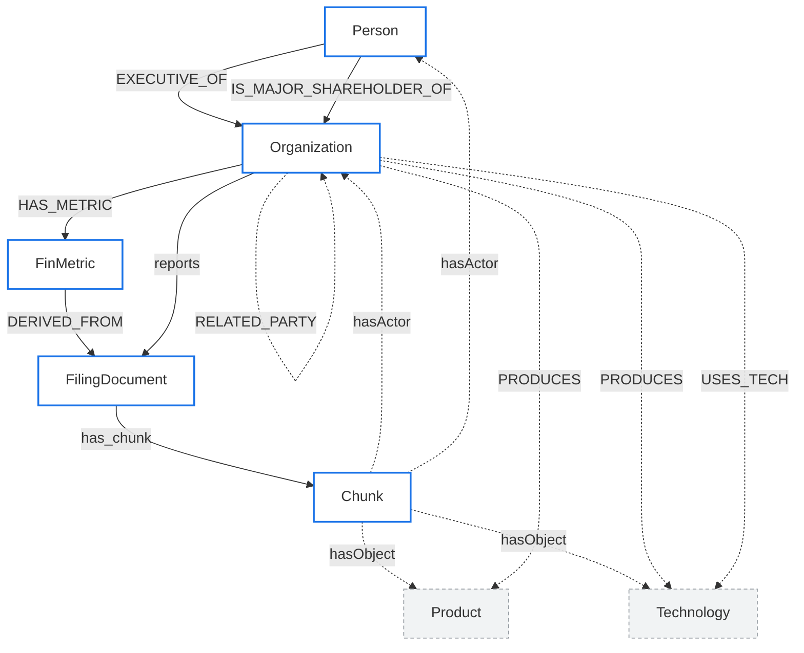

# POLARIS DB 설계서 — 03. Neo4j (그래프DB)

Neo4j = 엔티티·관계 그래프. 지분과 재무를 1급 시민으로 두고(멀티홉 질의), 모든 추출 관계는 PROV 근거(원문 청크·추출 활동)로 역추적한다. 공시 GraphRAG의 그래프 본체가 여기다.

---

## 1. 노드 라벨 표

| 라벨 | 키 | 주요 속성 | 설명 |
|---|---|---|---|
| `Organization` | corp_code (UNIQUE) | name, stock_code, founded | 회사 |
| `Person` | person_id | name, birth_ym | 임원·주주 |
| `FilingDocument` | rcept_no (UNIQUE) | doc_type, date | 공시문서 |
| `Chunk` | chunk_id (UNIQUE) | corp_code, chunk_type, section_path | 임베딩 단위 본문조각 |
| `FinMetric` | metric_id | account_id, bsns_year, value, unit | 재무지표 (MariaDB `fin_metric` 미러) |
| `Product` | product_id | name, canonical | 제품 |
| `Technology` | tech_id | name, canonical | 기술 |

> 추출 관계(claude)는 **별도 Statement reification 노드 없이 직접 엣지**로 적재한다. 근거는 엣지 속성(`chunk_id`·`rcept_no`·`confidence`·`extracted_by='claude'`) + MariaDB `extraction_provenance` 원장으로 추적한다. (이전 설계의 `Statement`/`Event`/`ExtractionActivity` 노드는 이중표현·그래프 탐색 단절 문제로 제거 — 필요 시 추후 재도입.)

---

## 2. 관계(엣지) 표

출처 구분 필수: `extracted_by IS NULL` = DART 공시·사실, `extracted_by='claude'` = 본문/뉴스 추출(언급·추정).

### 2-1. 정형 — extracted_by IS NULL (DART 공시·사실)

| 관계타입 | 출발 → 도착 | 속성 | 출처 |
|---|---|---|---|
| `:EXECUTIVE_OF` | Person → Organization | valid_from, rcept_no | DART 공시 (NULL) |
| `:IS_MAJOR_SHAREHOLDER_OF` | Organization \| Person → Organization | qota_rt, posesn_stock_co, rcept_no | DART 공시 (NULL) |
| `:INVESTS_IN` | Organization → Organization | qota_rt, rcept_no | DART 공시 (NULL) |
| `:IS_SUBSIDIARY_OF` | Organization → Organization | — | DART 공시 (NULL) |
| `:HAS_METRIC` | Organization → FinMetric | — | DART 공시 (NULL) |
| `:DERIVED_FROM` | FinMetric → FilingDocument | — | DART 공시 (NULL) |
| `:reports` | Organization → FilingDocument | — | DART 공시 (NULL) |
| `:has_chunk` | FilingDocument → Chunk | — | DART 공시 (NULL) |

### 2-2. 비정형 — extracted_by='claude' (본문/뉴스 추출)

모든 claude 추출 엣지는 근거 속성 공통: `extracted_by='claude'`, `chunk_id`(근거 청크), `rcept_no`(원문 공시), `confidence`. 청크로의 역추적은 이 `chunk_id`로(별도 reification 노드 없음). 원장은 MariaDB `extraction_provenance`.

| 관계타입 | 출발 → 도착 | 속성 | 출처 |
|---|---|---|---|
| `:hasActor` | Chunk → Organization \| Person | chunk_id 자명 | claude 추출 |
| `:hasObject` | Chunk → Product \| Technology | chunk_id 자명 | claude 추출 |
| `:PRODUCES` | Organization → Product \| Technology | chunk_id, rcept_no, confidence | claude 추출 |
| `:USES_TECH` | Organization → Technology | chunk_id, rcept_no, confidence | claude 추출 |
| `:SUPPLIES_TO` | Organization → Organization | chunk_id, rcept_no, confidence | claude 추출 |
| `:RELATED_PARTY` | Organization → Organization | relation_type, chunk_id, rcept_no, confidence | claude 추출 (특수관계자) |

---

## 3. 스키마 다이어그램 (Mermaid flowchart)

정형(실선) = DART 공시·사실, 비정형(점선) = claude 추출·언급.



범례: 실선 화살표 = 정형(DART 공시·사실), 점선 화살표 = 비정형(claude 추출). 파란 테두리 노드는 정형 그래프의 골격, 회색 점선 노드는 추출 레이어다.

---

## 4. Cypher 제약(CREATE CONSTRAINT) + 데이터 예시

### 4-1. 제약 (유니크/복합 키)

```cypher
// 단일 유니크 키
CREATE CONSTRAINT org_corp_code IF NOT EXISTS
  FOR (o:Organization) REQUIRE o.corp_code IS UNIQUE;
CREATE CONSTRAINT person_id IF NOT EXISTS
  FOR (p:Person) REQUIRE p.person_id IS UNIQUE;
CREATE CONSTRAINT filing_rcept_no IF NOT EXISTS
  FOR (f:FilingDocument) REQUIRE f.rcept_no IS UNIQUE;
CREATE CONSTRAINT finmetric_id IF NOT EXISTS
  FOR (m:FinMetric) REQUIRE m.metric_id IS UNIQUE;
CREATE CONSTRAINT product_id IF NOT EXISTS
  FOR (pr:Product) REQUIRE pr.product_id IS UNIQUE;
CREATE CONSTRAINT tech_id IF NOT EXISTS
  FOR (t:Technology) REQUIRE t.tech_id IS UNIQUE;
CREATE CONSTRAINT activity_key IF NOT EXISTS
  FOR (a:ExtractionActivity) REQUIRE a.activity_id IS UNIQUE;

// chunk_id 는 16hex 콘텐츠 해시이므로 단독으로 유일하다
CREATE CONSTRAINT chunk_key IF NOT EXISTS
  FOR (c:Chunk) REQUIRE c.chunk_id IS UNIQUE;
CREATE CONSTRAINT statement_key IF NOT EXISTS
  FOR (s:Statement) REQUIRE s.statement_id IS UNIQUE;
CREATE CONSTRAINT event_key IF NOT EXISTS
  FOR (e:Event) REQUIRE e.event_id IS UNIQUE;
```

### 4-2. 데이터 예시

```cypher
// 지분 (정형, extracted_by 미부여 = DART 공시·사실)
MERGE (s:Organization {corp_code: '00126380'})  // 삼성전자
MERGE (t:Organization {corp_code: '00164742'})
MERGE (s)-[:IS_MAJOR_SHAREHOLDER_OF {
  qota_rt: 23.1, posesn_stock_co: 1500000, rcept_no: '20250331000123'
}]->(t);

// 재무 (정형) — HAS_METRIC + DERIVED_FROM
MERGE (o:Organization {corp_code: '00126380'})
MERGE (m:FinMetric {metric_id: 'fm_2024_revenue_00126380'})
  SET m.account_id = 'ifrs-full_Revenue', m.bsns_year = 2024,
      m.value = 300870900000000, m.unit = 'KRW'
MERGE (f:FilingDocument {rcept_no: '20250331000123'})
  SET f.doc_type = 'A001', f.date = date('2025-03-31')
MERGE (o)-[:HAS_METRIC]->(m)
MERGE (m)-[:DERIVED_FROM]->(f);

// 추출 관계 (비정형, extracted_by='claude') — 직접 엣지 + 근거속성(chunk_id·rcept_no)
MERGE (sup:Organization {corp_code: '00164742'})
MERGE (buy:Organization {corp_code: '00126380'})
MERGE (sup)-[r:SUPPLIES_TO]->(buy)
  SET r.extracted_by='claude', r.confidence=0.86,
      r.chunk_id='a1b2c3d4e5f60718', r.rcept_no='20250311001085';
// 근거 원장은 MariaDB extraction_provenance 에 1행:
//   (prov_id, subject_id='00164742', predicate='SUPPLIES_TO', object_id='00126380',
//    chunk_id='a1b2c3d4e5f60718', rcept_no='20250311001085', extracted_by='claude', confidence=0.86)
// 역추적: r.chunk_id → (:Chunk {chunk_id}) ← (:FilingDocument)-[:has_chunk]-  → rcept_no
```

---

## 5. 핵심 규약

1. **출처 구분**: `extracted_by='claude'`(추출·언급) vs `extracted_by IS NULL`(DART 공시·사실). 그래프에서 "사실 vs 추정"을 색/구분으로 보여줄 근거가 된다.
2. **지분+재무 1급**: `IS_MAJOR_SHAREHOLDER_OF` / `INVESTS_IN`(지분%는 `qota_rt` 엣지속성) + `HAS_METRIC`(재무) → "지분 따라 멀티홉하며 각 회사 재무"를 한 질의로 탐색 가능. 이것이 GraphRAG의 핵심 차별점(벡터 RAG로는 불가).
3. **PROV 근거추적**: 모든 추출(claude) 엣지는 속성 `chunk_id`·`rcept_no`·`confidence`·`extracted_by='claude'`를 갖고, MariaDB `extraction_provenance`에 원장 1행을 남긴다. `chunk_id` → `Chunk` → `rcept_no`로 원문까지 역추적(별도 reification 노드 없음).
4. **변화감지**: 엣지 속성 `valid_from` + `rcept_no`(공시일)로 시점을 박제. 같은 지분/임원을 시점별로 비교할 수 있다.
5. **레퍼런스**: Neo4j sec-edgar(Company / Person / Form / Chunk + OWNS{지분, 시점}), Microsoft GraphRAG.

---

## 6. GraphRAG 활용 예시 Cypher

### 6-1. 지분 따라 2홉 + 각 회사 재무 (지분+재무 1급의 결과)

```cypher
MATCH (root:Organization {corp_code: '00126380'})
MATCH path = (root)-[:IS_MAJOR_SHAREHOLDER_OF|INVESTS_IN*1..2]->(target:Organization)
OPTIONAL MATCH (target)-[:HAS_METRIC]->(m:FinMetric {account_id: 'ifrs-full_Revenue'})
RETURN root.name AS 시작회사,
       [n IN nodes(path) | n.name] AS 지분경로,
       target.name AS 도착회사,
       m.bsns_year AS 사업연도,
       m.value AS 매출
ORDER BY length(path), 매출 DESC;
```

### 6-2. 청크 → 근거 역추적 (추출 관계의 출처 검증)

```cypher
MATCH (sup:Organization)-[r:SUPPLIES_TO {extracted_by:'claude'}]->(buy:Organization)
MATCH (c:Chunk {chunk_id: r.chunk_id})
OPTIONAL MATCH (f:FilingDocument)-[:has_chunk]->(c)
RETURN sup.name AS 공급사, buy.name AS 수요사, r.confidence AS 신뢰도,
       c.chunk_id AS 근거청크, c.section_path AS 섹션,
       f.rcept_no AS 원문공시번호, f.date AS 공시일;
```
