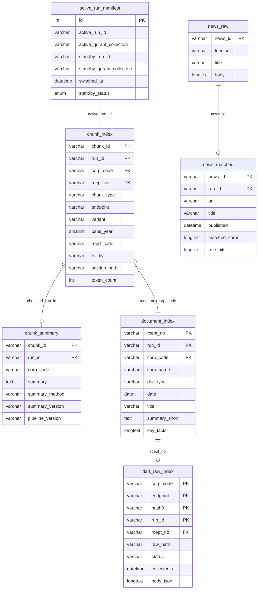
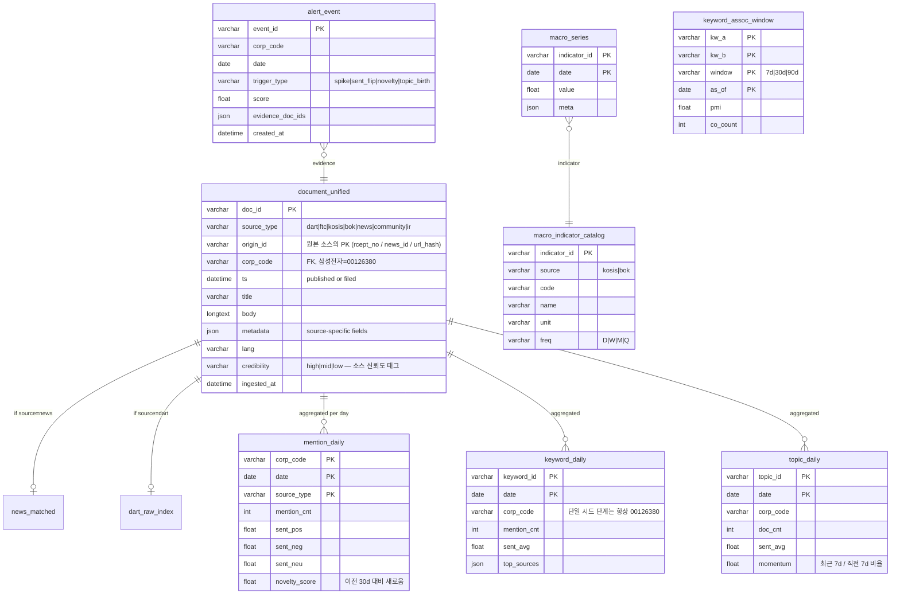

# POLARIS 3-DB ERD

> Neo4j (그래프) + Qdrant (벡터) + MariaDB (관계형) 통합 스키마.
> 작성: 2026-05-28 (claude-direct extraction + P0 fixes 후 상태 기준)

## 0. 전체 그림 — 3 DB 역할 분담 + 교차 키

```
┌─────────────────────┐    ┌─────────────────────┐    ┌─────────────────────┐
│      MariaDB        │    │      Qdrant         │    │      Neo4j          │
│  (관계형, source)    │    │  (벡터, search)     │    │  (그래프, traversal) │
├─────────────────────┤    ├─────────────────────┤    ├─────────────────────┤
│ active_run_manifest │◄──►│ polaris-1024-cos-   │    │ Chunk (10,008)      │
│ chunk_index 20k     │    │   blue/green        │    │ FilingDocument 104  │
│ chunk_summary 1.4k  │    │   (chunk 8,883)     │    │ Organization 781    │
│ dart_raw_index 2.3k │    │ polaris-org-er      │    │ Person 284          │
│ document_index 58   │    │   (Org 923)         │    │ FinMetric 3,957     │
│ news_matched 300    │    │                     │    │ Statement 402       │
│ news_raw            │    │                     │    │ Event 35            │
└─────────────────────┘    └─────────────────────┘    └─────────────────────┘
        │                          │                          │
        └──────┬───────────────────┴──────────┬───────────────┘
               │                              │
   ┌───────────┴──────────┐       ┌──────────┴────────────┐
   │  교차 키 (Universal) │       │  Blue/Green 운영       │
   ├──────────────────────┤       ├───────────────────────┤
   │ chunk_id (16 hex)    │       │ run_id (timestamp)     │
   │ corp_code (8 digit)  │       │ active vs standby      │
   │ rcept_no (14 digit)  │       │ promote = swap         │
   └──────────────────────┘       └───────────────────────┘
```

---

## 1. Neo4j — Graph Schema

### 1.1. 노드 종류 + 핵심 속성

```mermaid
classDiagram
    class Chunk {
        +chunk_id PK
        +run_id PK
        +corp_code
        +rcept_no
        +chunk_type [text_micro|text_macro|table_nl]
        +anchor
        +ingest_status
        +embedding_text_hash
    }
    class FilingDocument {
        +rcept_no PK
        +corp_code
        +doc_type
        +date
        +title
        +summary_short
        +body_chars
    }
    class Organization {
        +corp_code PK
        +name
        +bizrno
        +jurirno
        +stock_code
        +founded
    }
    class Person {
        +person_id PK
        +name
        +birth_ym
        +sexdstn
    }
    class Product {
        +product_id PK
        +name
        +canonical
        +category
        +aliases
        +source_chunk_id
        +extracted_by
    }
    class Technology {
        +tech_id PK
        +name
        +canonical
        +category
        +source_chunk_id
    }
    class Place {
        +iso_code PK
        +name
    }
    class FinMetric {
        +metric_id PK
        +rcept_no
        +year
        +account_id
        +sj_div
        +fs_div
        +value
        +unit
    }
    class Statement {
        +statement_id PK
        +run_id PK
        +subject_id
        +subject_type
        +predicate
        +object_id
        +object_type
        +confidence
        +source_chunk_id
        +extracted_by
    }
    class Event {
        +event_id PK
        +run_id PK
        +event_type
        +label
        +corp_code
        +source_chunk_id
        +confidence
    }
    class ExtractionActivity {
        +activity_id PK
        +run_id PK
        +extractor
        +pipeline_version
        +prompt_hash
        +chunks_processed
        +entities_extracted
    }
    class BusinessGroup {
        +unityGrupCode PK
        +name
        +representative_company
        +sum_cmpny_co
        +year
        +designation_date
    }
    class StatTable {
        +list_id PK
        +name
        +category
        +source
    }
    class MacroIndicator {
        +stat_code PK
        +name
        +unit
        +source
    }
```



### 1.2. 관계 (Edge) — Top 패턴

```
정형 backbone (어제 build 자동 생성):
  (Person) -[:EXECUTIVE_OF]-> (Organization)             644
  (Person) -[:IS_MAJOR_SHAREHOLDER_OF]-> (Organization)  1,429
  (Organization) -[:IS_MAJOR_SHAREHOLDER_OF]-> (Organization)  76
  (Organization) -[:IS_SUBSIDIARY_OF]-> (Organization)   69
  (Organization) -[:INVESTS_IN]-> (Organization)         2,307
  (Organization) -[:AFFILIATED_WITH]-> (BusinessGroup)   1,412
  (Organization) -[:HAS_METRIC]-> (FinMetric)            3,957
  (FinMetric) -[:DERIVED_FROM]-> (FilingDocument)        712
  (Organization) -[:reports]-> (FilingDocument)          62
  (FilingDocument) -[:has_chunk]-> (Chunk)               9,355

비정형 evidence (claude-direct LLM 추출):
  (Chunk) -[:hasActor]-> (Organization)                  10,310
  (Chunk) -[:hasActor]-> (Person)                        12
  (Chunk) -[:hasObject]-> (Product)                      216
  (Chunk) -[:hasObject]-> (Technology)                   46
  (Chunk) -[:hasObject]-> (Place)                        54
  (Event) -[:hasActor]-> (Organization)                  51

PROV-O (W3C):
  (Statement) -[:wasDerivedFrom]-> (Chunk)               402
  (Event) -[:wasDerivedFrom]-> (Chunk)                   35
  (Statement) -[:wasGeneratedBy]-> (ExtractionActivity)  402
  (Event) -[:wasGeneratedBy]-> (ExtractionActivity)      69
```

### 1.3. 라벨 marker (속성 X, identification only)

```
:LLMExtracted        — qwen / claude 가 만든 노드 (664)
:BackfilledStub      — P0-1 에서 자동 보강한 FilingDocument (22)
```

### 1.4. Graph 다이어그램 (관계 중심)

```
              ┌──────────────────┐
              │     Person       │
              └────────┬─────────┘
                       │ EXECUTIVE_OF / IS_MAJOR_SHAREHOLDER_OF
                       ▼
   ┌──────────────────────────────────────┐
   │            Organization              │◄──────┐
   │   (DART corp_code = 8 digit)         │       │
   └──┬──────┬───────┬─────────┬──────┬───┘       │
      │      │       │         │      │           │
      │      │       │         │      │           │ INVESTS_IN
      │      │       │         │      │           │ AFFILIATED_WITH
      │      │       │         │      │           │ IS_MAJOR_SHAREHOLDER_OF
      │ HAS_METRIC   │ reports │      │ AFFILIATED_WITH
      │      │       │         │      ▼           │
      │      │       │         │   BusinessGroup  │
      │      │       ▼         │                  │
      │      │  FilingDocument │                  │
      │      │       │         │                  │
      │      │       │ has_chunk                  │
      │      │       ▼         │                  │
      │      │     Chunk ◄─────┘ (text+table 본문) │
      │      │  ┌───┴────────────────────┐         │
      │      │  │ hasActor / hasObject   │         │
      │      │  │ (run_id 별)            │         │
      │      │  ▼                        │         │
      │      │ Product / Technology /    │         │
      │      │ Place / Organization      │         │
      │      │                           │         │
      │      │ wasDerivedFrom (PROV)     │         │
      │      └────┬──────────────────────┘         │
      │           │                                │
      │           ▼                                │
      │  ┌─────────────┐    ┌──────────────────┐  │
      │  │  Statement  │◄──►│ ExtractionActivity│ │
      │  │  (Tier 2)   │    │  (PROV agent)     │ │
      │  └─────────────┘    └──────────────────┘  │
      │                                            │
      │           ▼                                │
      │  ┌─────────────┐                          │
      │  │   Event     │ — hasActor → Organization┘
      │  │   (Tier 3)  │
      │  └─────────────┘
      │
      ▼
   FinMetric — DERIVED_FROM → FilingDocument
```

---

## 2. Qdrant — Vector Collections

### 2.1. polaris-1024-cos-{blue|green} (Blue/Green, Chunk embeddings)

```
Collection: polaris-1024-cos-green   ← standby (8,883 points)
            polaris-1024-cos-blue    ← active  (0 points, 비어있음)
Dim: 1024 (bge-m3)
Distance: Cosine
Provider: Ollama bge-m3

┌──────────────────────────────────────────────────────────┐
│ Vector (1024-dim float)                                  │
├──────────────────────────────────────────────────────────┤
│ Payload:                                                 │
│   chunk_id          (16 hex)        ← Neo4j Chunk PK     │
│   run_id            (timestamp)     ← 블루/그린 식별       │
│   corp_code         (8 digit)       ← MariaDB FK         │
│   corp_name         (string)                             │
│   rcept_no          (14 digit)      ← Filing FK          │
│   bsns_year         (year)                               │
│   reprt_code        (DART code)                          │
│   chunk_type        (text_micro|text_macro|table_nl)     │
│   section_path      (e.g. "II/2/다")                     │
│   section_headings  (list)                               │
│   anchor                                                 │
│   fs_div / sj_div   (재무제표 구분)                       │
│   account_id        (재무 계정)                          │
│   ingest_status                                          │
└──────────────────────────────────────────────────────────┘
```

**용도**: 키워드 검색 → top-K chunks → Neo4j Chunk 노드 lookup → graph traversal

### 2.2. polaris-org-er (Entity Resolution, Org names)

```
Collection: polaris-org-er           ← 923 points
Dim: 1024 (bge-m3)
Distance: Cosine

┌────────────────────────────────────┐
│ Vector (1024-dim)                  │
├────────────────────────────────────┤
│ Payload:                           │
│   corp_code   (Neo4j Org PK)       │
│   name        (회사명)             │
│   source      ("neo4j_extract")    │
└────────────────────────────────────┘
```

**용도**: linker Stage 2 — yaml 사전에 없는 회사명 → bge-m3 유사도 → 기존 corp_code 매칭

---

## 3. MariaDB — Relational

### 3.1. ER 다이어그램



### 3.2. 테이블별 역할 + 행수

| 테이블 | 행수 | 역할 |
|---|---|---|
| `active_run_manifest` | 1 | Blue/Green pointer (active vs standby run_id) |
| `chunk_index` | 20,016 | Chunk metadata (corp_code, rcept_no, section_path 등). Neo4j Chunk 노드와 1:1 |
| `chunk_summary` | 1,372 | LLM 으로 생성한 chunk 요약 |
| `dart_raw_index` | 2,300 | DART API 원본 JSON 응답 cache |
| `document_index` | 58 | 공시문서 메타 (doc_type, key_facts). Neo4j FilingDocument 와 동기화 |
| `news_matched` | 300 | 뉴스 - 회사 매칭 결과 |
| `news_raw` | 0 | 뉴스 원본 (현재 비어있음) |

---

## 4. 교차 키 (Cross-DB Foreign Keys)

### 4.1. Universal Keys

| 키 | 형식 | MariaDB | Qdrant | Neo4j |
|---|---|---|---|---|
| `chunk_id` | 16 hex chars | `chunk_index.chunk_id` PK | payload 필수 | `Chunk.chunk_id` PK |
| `run_id` | `YYYYMMDD_HHMM_NN` | `active_run_manifest.{active,standby}_run_id` | payload 필수 | `Chunk.run_id` PK + Statement/Event/Activity |
| `corp_code` | 8 digit | `chunk_index.corp_code` | payload | `Organization.corp_code` PK |
| `rcept_no` | 14 digit | `document_index.rcept_no` PK | payload | `FilingDocument.rcept_no` PK |
| `metric_id` | hash | — | — | `FinMetric.metric_id` PK |

### 4.2. RAG flow — 3DB 연쇄 호출 예시

```
사용자 쿼리: "삼성전자 HBM4 전략"

Step 1. MariaDB
  ─► SELECT active_qdrant_collection FROM active_run_manifest
     → "polaris-1024-cos-blue" or "green"

Step 2. Qdrant
  ─► embed_query("삼성전자 HBM4 전략") → vec[1024]
  ─► query_points(collection, vec, top_k=5)
     → [{chunk_id, corp_code, run_id, ...} × 5]

Step 3. Neo4j
  ─► MATCH (c:Chunk {chunk_id: $cid})
       OPTIONAL MATCH (c)-[:hasActor]->(actor:Organization|Person)
       OPTIONAL MATCH (c)-[:hasObject]->(obj:Product|Technology|Place)
       OPTIONAL MATCH (c)<-[:wasDerivedFrom]-(s:Statement)
       OPTIONAL MATCH (s)-[:wasGeneratedBy]->(a:ExtractionActivity)
     → graph context

Step 4. (선택) MariaDB chunk_summary
  ─► SELECT summary FROM chunk_summary WHERE chunk_id = ?
     → LLM 요약 텍스트 (RAG context)

Step 5. 답변 + Citation
  ─► "삼성전자는 HBM4와 DDR5 등 고부가가치 제품에 대응 중입니다.
      (출처: 사업보고서 (2025.12) IV. 경영진단 > 2. 개요, chunk c151db1b...)"
```

---

## 5. Blue/Green 운영 (active_run_manifest 중심)

```
                        active_run_manifest (id=1, single row)
                        ┌──────────────────────────────────┐
                        │ active_run_id    : '20260528_..' │  ← 운영중
                        │ active_qdrant    : 'green'       │
                        │ standby_run_id   : '20260529_..' │  ← 빌드중
                        │ standby_qdrant   : 'blue'        │
                        │ standby_status   : 'ingesting'   │
                        └─────────────┬────────────────────┘
                                      │ promote (swap)
                                      ▼
                        ┌──────────────────────────────────┐
                        │ active_run_id    : '20260529_..' │  ← 운영중
                        │ active_qdrant    : 'blue'        │
                        │ standby_run_id   : '20260528_..' │  ← 이전
                        │ standby_qdrant   : 'green'       │
                        │ standby_status   : 'ready'       │
                        └──────────────────────────────────┘

운영 원칙:
  - 모든 write 는 standby 에 들어감 (run_id = standby_run_id)
  - 모든 read 는 active 에서 (run_id = active_run_id)
  - promote 시 standby ↔ active swap, downtime 0
  - 현재 상태: active = None (promote 안 됨), standby = '20260528_0808_01'
```

---

## 6. 데이터 흐름 (Build Pipeline)

```
[1. Ingest]    DART API ──► dart_raw_index (MariaDB)
[2. Document]  dart_raw_index ──► document_index (MariaDB)
                                 ──► FilingDocument (Neo4j)
[3. Chunk]     document body ──► chunk_index (MariaDB)
                              ──► Chunk node (Neo4j)
                              ──► chunk text → Embed (Ollama bge-m3)
                                  ──► polaris-1024-cos-{blue|green} (Qdrant)
[4. Finance]   filings ──► FinMetric (Neo4j) ── HAS_METRIC → Organization
[5. NL Tables] table chunks ──► chunk_summary (MariaDB, table → NL)
[6. LLM Extract] chunks ──► (qwen/claude) ──► Statement/Event (Neo4j)
                                          ──► hasActor/hasObject edges
                                          ──► PROV (wasDerivedFrom/wasGeneratedBy)
[7. Promote]   active_run_manifest swap (blue ↔ green)
```

---

## 7. 현재 데이터 상태 (2026-05-28, 삼성전자 only)

| 영역 | 항목 | 카운트 |
|---|---|---|
| **MariaDB** | chunk_index | 20,016 |
| | document_index | 58 |
| | dart_raw_index | 2,300 |
| | chunk_summary | 1,372 |
| **Qdrant** | polaris-1024-cos-green (standby) | 8,883 chunks |
| | polaris-org-er | 923 orgs |
| **Neo4j** | Chunk | 10,008 |
| | FilingDocument (22 stub backfill 포함) | 104 |
| | Organization (171 dup 머지됨) | 781 |
| | Person | 284 |
| | Product (claude+yaml) | 55 |
| | Technology | 28 |
| | Place | 31 |
| | FinMetric | 3,957 |
| | Statement (claude-direct) | 402 |
| | Event (claude-direct) | 35 |
| | ExtractionActivity | 2 |
| | hasActor edges | 20,746 |
| | has_chunk edges | 18,710 |

**Chunk evidence coverage**: 9,950 / 10,008 (99.4%) — *남은 58 은 빈 rcept_no chunk*
**Statement PROV**: 402/402 (100%)
**Event PROV**: 35/35 (100%)
**Org dup**: 0 (171 그룹 머지 완료)

---

## 참고 문서

- ADR 010 — Chunk evidence edge recovery
- ADR 011 — Event PROV recovery
- ADR 012 — corp_code canonicalization
- ADR 016 — Chunk store consistency (Blue/Green)
- ADR 020 — SOTA upgrade plan (Phase A-D)
- ADR 021 — Claude-direct extraction (현재 상태 기준)
- `docs/CLAUDE_DIRECT_PLAYBOOK.md` — 다른 회사 추출 가이드
- `docs/ARCHITECTURE.md` — 전체 시스템 구조

---

## 8. Sometrend 융합 확장안 (v2, 2026-05-29 결정)

### 8.0. 설계 결정 요약

| 항목 | 결정 | ERD 영향 |
|---|---|---|
| 1차 분석 단위 | **회사 단일 시드 (삼성전자 `00126380`)** | 검색 진입점 없음 → 회사 dashboard 직진. corp_code FK 모든 신규 테이블 필수 |
| 시계열 grain | **일(day) 단위** | `*_daily` 집계 테이블, 시간/분 grain 없음 |
| 데이터 소스 | **다중**: 뉴스 + DART + FTC + KOSIS + BOK + 커뮤니티/블로그 + IR PDF | 소스별 raw + 통합 `document_unified` 추상화 필요 |
| 분석 차원 | 추이 / 연관어 / 감성 / 토픽 / 비교(향후) | Keyword, Topic, Sentiment 노드 + 일 집계 테이블 |

### 8.1. 신규 데이터 흐름 (전체 그림)

```
[소스 레이어 (raw)]
  뉴스 크롤러 ──► news_raw / news_matched (MariaDB, 기존)
  DART API   ──► dart_raw_index (기존)
  FTC        ──► ftc_raw_index (chunk/ftc.py 활용)
  KOSIS      ──► kosis_raw_index (신규)
  BOK ECOS   ──► bok_raw_index (신규)
  커뮤니티   ──► community_raw (신규, blog/forum/youtube comments)
  IR PDF     ──► ir_report_raw (신규)
            │
            ▼
[정규화 레이어 (unified)]
  document_unified (MariaDB) — 소스 불문 단일 인터페이스
            │
            ├──► Chunk (Neo4j, 기존 + Document 라벨 추가)
            ├──► polaris-doc-1024 (Qdrant 통합 컬렉션, payload.source_type 필터)
            └──► macro_series (MariaDB, KOSIS/BOK 시계열만)
            │
            ▼
[추출 레이어 (claude-direct)]
  엔티티/관계/이벤트 (기존)
  + Keyword/Topic/Sentiment (신규)
            │
            ▼
[집계 레이어 (precompute, dashboard 응답성)]
  mention_daily / keyword_daily / topic_daily / sentiment_daily (MariaDB)
  alert_event (스파이크/감성반전/신규성 감지)
            │
            ▼
[제공 레이어 (Dashboard API)]
  /corp/{code}/trend  /corp/{code}/keywords  /corp/{code}/sentiment
  /corp/{code}/topics  /corp/{code}/alerts   /corp/{code}/graph
```

### 8.2. MariaDB — 신규/확장 테이블



> **권고:** `document_unified.body`는 검색/추출 입력으로만 쓰고, 원본은 raw 테이블에 그대로 둡니다. unified는 손실 허용 정규화 레이어 — 스키마 흔들림 흡수용.

### 8.3. Neo4j — 신규 노드/엣지

```
신규 노드:
  Document      (multi-label: NewsArticle | DARTFiling | CommunityPost | IRReport | FTCDecision)
                {doc_id PK, source_type, ts, title, body_hash, corp_code, credibility}
  Keyword       {keyword_id PK, surface, canonical, category, dict_source, first_seen_ts}
  Topic         {topic_id PK, label, keywords[], created_at, method[bertopic|llm], confidence}
  Sentiment     {sent_id PK, polarity[-1..1], magnitude, label, model_version}
                  → Embedded property pattern 도 가능. 별도 노드는 "감성 변화 이력"이 필요할 때.

신규 엣지 (시간/가중치는 모두 엣지 속성):
  (Document)    -[:ABOUT {weight, ts}]->                    (Organization)   ← 1차 주제 회사
  (Document)    -[:MENTIONS {weight, ctx, ts}]->            (Organization|Product|Technology|Keyword)
  (Document)    -[:OF_TOPIC {prob}]->                       (Topic)
  (Document)    -[:HAS_SENTIMENT {target_id, target_type, polarity, ts}]-> (Sentiment)
  (Keyword)     -[:CO_OCCURS_WITH {window, as_of, pmi, count}]-> (Keyword)
  (Organization)-[:DAILY_SIGNAL {date, mention_cnt, sent_avg, novelty}]->  (Topic)
                  ↑ 그래프에 직접 두지 말고 MariaDB topic_daily 만 두는 것도 OK. 그래프 쿼리에서
                    "삼성전자가 최근 가장 뜬 토픽" 식 traversal 이 필요하면 엣지 유지.

기존 패턴 재활용:
  PROV-O: 모든 Keyword/Topic/Sentiment 추출도 ExtractionActivity 로 연결 (감사 가능성 유지)
  Chunk vs Document: Chunk 는 임베딩 단위(이전과 동일), Document 는 의미 단위(1 article = 1 Document, N Chunk).
                     (Document) -[:HAS_CHUNK]-> (Chunk) 추가.
```

### 8.4. Qdrant — 컬렉션 전략

| 컬렉션 | 차원 | 용도 | payload 핵심 필드 |
|---|---|---|---|
| `polaris-1024-cos-{blue\|green}` (기존) | 1024 | DART chunk 검색 | chunk_id, run_id, corp_code, rcept_no |
| `polaris-news-body-1024` (기존) | 1024 | 뉴스 본문 검색 | news_id, corp_code, published |
| **`polaris-doc-1024`** (신규, 통합) | 1024 | 멀티소스 통합 검색 | doc_id, **source_type**, corp_code, ts, credibility |
| **`polaris-keyword-1024`** (신규) | 1024 | 의미 유사 키워드 클러스터링 | keyword_id, canonical, category |
| **`polaris-topic-1024`** (신규) | 1024 | 토픽 라벨/대표문장 임베딩 | topic_id, label, method |
| `polaris-org-er` (기존) | 1024 | 회사명 ER | corp_code, name |

> **단일 통합 컬렉션 + `source_type` payload 필터** 가 권장안. 소스별 분리는 운영 복잡도만 늘고, cross-source 검색(이 서비스의 핵심 가치)을 막습니다.

### 8.5. 교차 키 매트릭스 — v2 추가분

| 키 | 형식 | MariaDB | Qdrant | Neo4j |
|---|---|---|---|---|
| `doc_id` | sha1(source+origin_id)[:16] | `document_unified.doc_id` PK | `polaris-doc-1024` payload | `Document.doc_id` PK |
| `keyword_id` | sha1(canonical)[:12] | `keyword_daily.keyword_id` PK | `polaris-keyword-1024` payload | `Keyword.keyword_id` PK |
| `topic_id` | `topic_YYYYMM_NNN` | `topic_daily.topic_id` PK | `polaris-topic-1024` payload | `Topic.topic_id` PK |
| `indicator_id` | `{source}:{code}` | `macro_series.indicator_id` PK | — | `MacroIndicator.indicator_id` PK |

### 8.6. Dashboard 위젯 ↔ ERD 매핑 (확정 가이드)

| 위젯 (썸트렌드 컨셉) | 쿼리 대상 | 비고 |
|---|---|---|
| 일별 멘션 추이 라인 | MariaDB `mention_daily` | precompute, <50ms |
| 감성 분포 도넛 | MariaDB `mention_daily` (sent_*) | 동일 |
| 연관어 네트워크 그래프 | Neo4j `Keyword-[CO_OCCURS_WITH]-Keyword` + MariaDB `keyword_assoc_window` | 그래프 시각화 = 이 프로젝트 차별점 |
| 토픽 카드 (모멘텀 순) | MariaDB `topic_daily` + Neo4j `Topic` | momentum DESC |
| 알림/스파이크 | MariaDB `alert_event` | 일배치 |
| 뉴스/공시 evidence 패널 | Qdrant `polaris-doc-1024` → MariaDB `document_unified` | 클릭한 노드 컨텍스트 |
| GraphRAG 답변 (자연어 Q) | Qdrant → Neo4j 1-2 hop → LLM | 기존 RAG flow 유지 |

### 8.7. ERD를 "동시에" 그리는 방법론 (의사결정 기록)

3DB를 한 장에 그리지 않습니다. 본 문서가 채택한 패턴:

```
Layer 0 (Section 0)   : 3 박스 + 교차키 박스   (ASCII art / flowchart)
Layer 1 (Section 1)   : Neo4j 노드 속성        (mermaid classDiagram)
Layer 1' (Section 1.2): Neo4j 엣지             (텍스트 리스트 — classDiagram 으로 그리면 깨짐)
Layer 2 (Section 2)   : Qdrant 컬렉션          (박스/표)
Layer 3 (Section 3)   : MariaDB                (mermaid erDiagram)
Layer 4 (Section 4)   : Cross-DB Keys          (표)
Layer 5 (Section 5-6) : Blue/Green + Pipeline  (시퀀스/플로우)
```

도구는 **Mermaid 유지**. 한 `.md` 파일에 `erDiagram` + `classDiagram` + `flowchart` 가 공존 가능하고, GitHub/Obsidian 렌더링이 가능하기 때문. dbdiagram.io는 관계형 전용, drawio는 수동, PlantUML은 그래프DB 표현이 빈약.

### 8.8. 구현 우선순위 (P0 → P2)

| 우선순위 | 항목 | 이유 |
|---|---|---|
| **P0** | `document_unified` + `mention_daily` + 뉴스 일배치 집계 | 대시보드 v0 = "삼성전자 일별 멘션 추이" 만 보여줘도 동작 |
| **P0** | Neo4j `Document` 라벨 + `ABOUT` 엣지 | 기존 chunk_evidence 위에 얇게 |
| **P1** | Keyword/Topic 추출 (Claude-direct) + `keyword_daily` / `topic_daily` | 연관어/토픽 위젯 |
| **P1** | `polaris-doc-1024` 통합 컬렉션 | cross-source 검색 |
| **P2** | KOSIS/BOK `macro_series` + IR PDF 파서 | 매크로 컨텍스트 |
| **P2** | `alert_event` + 스파이크 감지 | 알림 컨셉 |
| **P2** | 커뮤니티 크롤러 (저작권/이용약관 검토 선행) | 비공개 운영 단계만 |

### 8.9. Drill-down 역참조 규칙 (관계 중심 확정 — 2026-05-29)

POLARIS = "관계·구조 데이터" 회사로 확정. 화면 철학 = **"차트는 질문, 그래프는 답"**.
→ **모든 집계 숫자는 그래프로 drill-down 가능해야 한다.** 차트의 점 하나 = 그래프 부분집합으로 가는 입구.

원칙:
- **Neo4j = source of truth (관계).** MariaDB `*_daily` = 그래프 위 요약 캐시. 캐시는 언제든 그래프에서 재생성 가능해야 함.
- 모든 집계 row는 자신을 구성한 `Document` 집합으로 역추적되어야 함.

스키마 추가:
```
mention_daily   + evidence_doc_ids JSON   -- 그 (corp,date,source) 멘션을 만든 doc_id[]
keyword_daily   + evidence_doc_ids JSON
topic_daily     + evidence_doc_ids JSON
-- 또는 별도 역인덱스 테이블:
daily_doc_map(corp_code, date, metric_type, doc_id)  PK(corp_code,date,metric_type,doc_id)
```

drill-down 흐름 (예: 멘션 추이 스파이크 클릭):
```
1. MariaDB  mention_daily WHERE corp,date=클릭일 → evidence_doc_ids[]
2. Neo4j    MATCH (d:Document) WHERE d.doc_id IN $ids
              MATCH (d)-[:MENTIONS]->(e) RETURN d,e   -- 그날의 관계 스냅샷
3. 화면     그래프가 "그 시점" 부분집합으로 다시 그려짐
```
이 한 가지가 토스(차트에서 끝)·썸트렌드(키워드 구름에서 끝)와의 구조적 차별을 ERD 레벨에서 보장한다.

### 8.10. 데이터 소스 확정 반영 + ERD Freeze (v2.1 — 2026-05-29)

**확정된 데이터 소스 (4개 층)**
```
① 골격: 공시 DART · 공정위 FTC
② 근육: 기업 공식 IR · 뉴스 · 한경컨센서스/네이버 리서치
③ 신경: 채용공고 · 커뮤니티/SNS (신호용, 원문 비저장)
④ 배경: 통계청 KOSIS · 한국은행 ECOS · 특허 Google Patents(메인)/USPTO(보조)
제외: KIPRIS Plus(유료) · 증권사 원본 리포트(유료)
```

**신규 반영 ①: 특허 (Google Patents BigQuery)**
```
Neo4j 신규 노드:
  Patent {patent_id PK, country, pub_date, cpc[], assignee_corp_code, title, source[gpat|uspto]}
신규 엣지:
  (Organization) -[:HOLDS_PATENT {date}]-> (Patent)
  (Patent) -[:ABOUT]-> (Technology)        -- 회사↔기술 관계의 핵심
  (Patent) -[:CITES]-> (Patent)            -- 특허 인용망 (경쟁/협력 신호)
MariaDB: patent_raw(patent_id PK, country, pub_date, cpc JSON, assignee, body JSON)
Qdrant: (선택) 특허 초록을 polaris-doc-1024 에 source_type=patent 로 통합
```

**신규 반영 ②: 멀티소스 source_type 확장**
```
document_unified.source_type = dart | ftc | kosis | bok | news | ir | recruit | community | patent
Neo4j Document 보조 라벨 += IRReport | RecruitPosting
```

**발견(Discovery) 메커니즘 — 스키마 영향 없음 확인**
- "모르는 대상 발견" = 경로탐색 ✕ → 이웃 등장 + 이상탐지/랭킹 ○
- 신규성: `mention_daily.novelty_score`, `Keyword.first_seen_ts` (이미 보유)
- 중심성/영향전파: Neo4j GDS = 런타임 계산, 스키마 불필요. 캐시 필요 시 노드 속성으로 비파괴적 추가.
- 경로탐색(아는 두 노드의 숨은 연결): `shortestPath` — 정형 backbone이 이미 풍부해 추가 스키마 불필요.

**ERD Freeze 판정**
- ✅ 골격 동결: 노드 타입 · 3DB 역할 · 교차키(chunk_id/doc_id/corp_code/rcept_no) · drill-down 역참조
- ✅ 확장 안전성: 단일 시드(삼성)→다회사 확장은 `corp_code`가 모든 곳에 있어 **스키마 변경 없이** 데이터만 추가. 소스 추가도 `source_type` 확장으로 흡수.
- ⏳ 구현 중 미세조정 허용(골격 불변): Sentiment 노드 vs 속성 · 중심성 캐시 컬럼 · 엣지 속성 세부.

→ **v2.1로 ERD 동결.** 이후 변경은 골격이 아니라 위 ⏳ 디테일 한정.
